# MyFinance — Platform Independent Model (PIM)

| | |
|---|---|
| **Application version** | v0.2 |
| **Document version** | v0.2.0 |
| **Last updated** | 2026-02-26 |
| **Last code sync** | branch `claude/generate-pim-ontology-8ah2U` @ 2026-02-26 |

> Reverse-engineered from the codebase. Captures the domain semantics of a **personal finance management application with AI-powered transaction classification**.
>
> This document describes the **current implemented state** of the application. Proposed evolutions are tracked in separate files under [`docs/evolutions/`](evolutions/).

---

## 1. UML Class Diagram (PlantUML)

### 1a. Domain Class Diagram

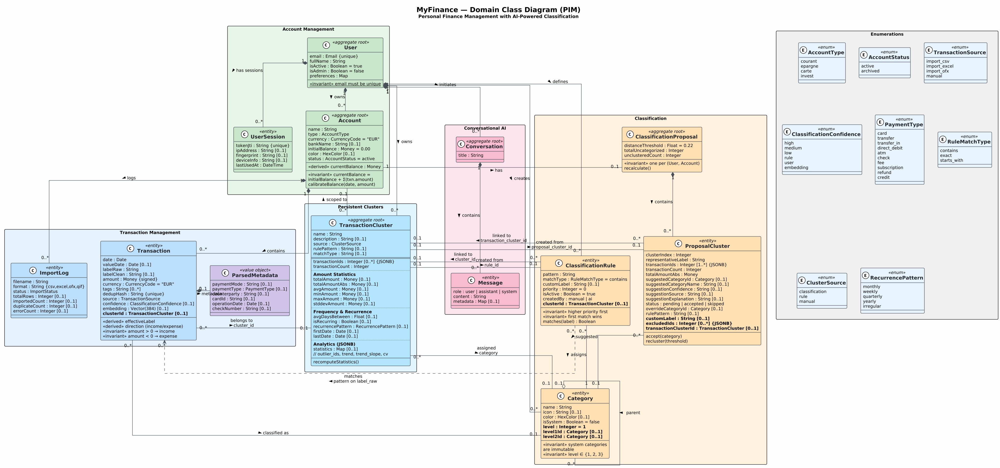

<details>
<summary>PlantUML source</summary>

```plantuml
@startuml MyFinance_PIM_ClassDiagram
!theme plain
skinparam classAttributeIconSize 0
skinparam linetype ortho
skinparam groupInheritance 2
skinparam defaultFontSize 11
skinparam classFontSize 13
skinparam classFontStyle bold
skinparam dpi 150
skinparam backgroundColor #FEFEFE

skinparam class {
  BackgroundColor #F8F9FA
  BorderColor #495057
  ArrowColor #495057
  FontColor #212529
  HeaderBackgroundColor #E9ECEF
}

skinparam stereotype {
  CBackgroundColor #FFF3CD
  EBackgroundColor #D1ECF1
}

title <size:18>MyFinance — Domain Class Diagram (PIM)</size>
<size:12>Personal Finance Management with AI-Powered Classification</size>

' ──────────────────────────────────────────────
' ENUMERATIONS
' ──────────────────────────────────────────────

package "Enumerations" <<Rectangle>> #F0F0F0 {

  enum AccountType <<enum>> #E8F4FD {
    courant
    epargne
    carte
    invest
  }

  enum AccountStatus <<enum>> #E8F4FD {
    active
    archived
  }

  enum TransactionSource <<enum>> #E8F4FD {
    import_csv
    import_excel
    import_ofx
    manual
  }

  enum ClassificationConfidence <<enum>> #E8F4FD {
    high
    medium
    low
    rule
    user
    embedding
  }

  enum PaymentType <<enum>> #E8F4FD {
    card
    transfer
    transfer_in
    direct_debit
    atm
    check
    fee
    subscription
    refund
    credit
  }

  enum RuleMatchType <<enum>> #E8F4FD {
    contains
    exact
    starts_with
  }

  enum ClusterSource <<enum>> #E8F4FD {
    classification
    rule
    manual
  }

  enum RecurrencePattern <<enum>> #E8F4FD {
    monthly
    weekly
    quarterly
    yearly
    irregular
  }
}

' ──────────────────────────────────────────────
' DOMAIN ENTITIES
' ──────────────────────────────────────────────

package "Account Management" <<Rectangle>> #E8F5E9 {

  class User <<aggregate root>> #C8E6C9 {
    email : Email {unique}
    fullName : String
    isActive : Boolean = true
    isAdmin : Boolean = false
    preferences : Map
    --
    {static} <<invariant>> email must be unique
  }

  class UserSession <<entity>> #C8E6C9 {
    tokenJti : String {unique}
    ipAddress : String [0..1]
    fingerprint : String [0..1]
    deviceInfo : String [0..1]
    lastUsedAt : DateTime
  }

  class Account <<aggregate root>> #C8E6C9 {
    name : String
    type : AccountType
    currency : CurrencyCode = "EUR"
    bankName : String [0..1]
    initialBalance : Money = 0.00
    color : HexColor [0..1]
    status : AccountStatus = active
    --
    <<derived>> currentBalance : Money
    --
    <<invariant>> currentBalance =
      initialBalance + Σ(txn.amount)
    calibrateBalance(date, amount)
  }
}

package "Transaction Management" <<Rectangle>> #E3F2FD {

  class Transaction <<entity>> #BBDEFB {
    date : Date
    valueDate : Date [0..1]
    labelRaw : String
    labelClean : String [0..1]
    amount : Money {signed}
    currency : CurrencyCode = "EUR"
    tags : String [0..*]
    dedupHash : String {unique}
    source : TransactionSource
    confidence : ClassificationConfidence [0..1]
    embedding : Vector(384) [0..1]
    **clusterId : TransactionCluster [0..1]**
    --
    <<derived>> effectiveLabel
    <<derived>> direction (income/expense)
    <<invariant>> amount > 0 → income
    <<invariant>> amount < 0 → expense
  }

  class ParsedMetadata <<value object>> #D1C4E9 {
    paymentMode : String [0..1]
    paymentType : PaymentType [0..1]
    counterparty : String [0..1]
    cardId : String [0..1]
    operationDate : Date [0..1]
    checkNumber : String [0..1]
  }

  class ImportLog <<entity>> #BBDEFB {
    filename : String
    format : String {csv,excel,ofx,qif}
    status : ImportStatus
    totalRows : Integer [0..1]
    importedCount : Integer [0..1]
    duplicateCount : Integer [0..1]
    errorCount : Integer [0..1]
  }
}

package "Classification" <<Rectangle>> #FFF3E0 {

  class Category <<entity>> #FFE0B2 {
    name : String
    icon : String [0..1]
    color : HexColor [0..1]
    isSystem : Boolean = false
    **level : Integer = 1**
    **level1Id : Category [0..1]**
    **level2Id : Category [0..1]**
    --
    <<invariant>> system categories
      are immutable
    <<invariant>> level ∈ {1, 2, 3}
  }

  class ClassificationRule <<entity>> #FFE0B2 {
    pattern : String
    matchType : RuleMatchType = contains
    customLabel : String [0..1]
    priority : Integer = 0
    isActive : Boolean = true
    createdBy : manual | ai
    **clusterId : TransactionCluster [0..1]**
    --
    <<invariant>> higher priority first
    <<invariant>> first match wins
    matches(label) : Boolean
  }

  class ClassificationProposal <<aggregate root>> #FFE0B2 {
    distanceThreshold : Float = 0.22
    totalUncategorized : Integer
    unclusteredCount : Integer
    --
    <<invariant>> one per (User, Account)
    recalculate()
  }

  class ProposalCluster <<entity>> #FFE0B2 {
    clusterIndex : Integer
    representativeLabel : String
    transactionIds : Integer [1..*] {JSONB}
    transactionCount : Integer
    totalAmountAbs : Money
    suggestedCategoryId : Category [0..1]
    suggestedCategoryName : String [0..1]
    suggestionConfidence : String [0..1]
    suggestionSource : String [0..1]
    suggestionExplanation : String [0..1]
    status : pending | accepted | skipped
    overrideCategoryId : Category [0..1]
    rulePattern : String [0..1]
    **customLabel : String [0..1]**
    **excludedIds : Integer [0..*] {JSONB}**
    **transactionClusterId : TransactionCluster [0..1]**
    --
    accept(category)
    recluster(threshold)
  }
}

package "Persistent Clusters" <<Rectangle>> #E1F5FE {

  class TransactionCluster <<aggregate root>> #B3E5FC {
    name : String
    description : String [0..1]
    source : ClusterSource
    rulePattern : String [0..1]
    matchType : String [0..1]
    ==
    transactionIds : Integer [0..*] {JSONB}
    transactionCount : Integer
    ..
    **Amount Statistics**
    totalAmount : Money [0..1]
    totalAmountAbs : Money [0..1]
    avgAmount : Money [0..1]
    minAmount : Money [0..1]
    maxAmount : Money [0..1]
    stddevAmount : Money [0..1]
    ..
    **Frequency & Recurrence**
    avgDaysBetween : Float [0..1]
    isRecurring : Boolean [0..1]
    recurrencePattern : RecurrencePattern [0..1]
    firstDate : Date [0..1]
    lastDate : Date [0..1]
    ..
    **Analytics (JSONB)**
    statistics : Map [0..1]
    // outlier_ids, trend, trend_slope, cv
    --
    recomputeStatistics()
  }
}

package "Conversational AI" <<Rectangle>> #FCE4EC {

  class Conversation <<aggregate root>> #F8BBD0 {
    title : String
  }

  class Message <<entity>> #F8BBD0 {
    role : user | assistant | system
    content : String
    metadata : Map [0..1]
  }
}

' ──────────────────────────────────────────────
' RELATIONSHIPS
' ──────────────────────────────────────────────

User "1" *-down- "0..*" Account : owns >
User "1" *-right- "0..*" Category : creates >
User "1" *-- "0..*" ClassificationRule : defines >
User "1" *-down- "0..*" Conversation : initiates >
User "1" *-- "0..*" UserSession : has sessions >
User "1" *-- "0..*" TransactionCluster : owns >

Account "1" *-down- "0..*" Transaction : contains >
Account "1" -- "0..1" ClassificationProposal : has >
Account "1" *-- "0..*" ImportLog : logs >

Transaction "0..*" -- "0..1" Category : classified as >
Transaction "1" *-right- "0..1" ParsedMetadata : metadata >
Transaction "0..*" -- "0..1" TransactionCluster : <<belongs to>>
cluster_id >

Category "0..1" o-- "0..*" Category : parent >

ClassificationRule "0..*" -- "1" Category : assigns >
ClassificationRule "0..*" -- "0..1" TransactionCluster : <<linked to>>\ncluster_id >
ClassificationRule "0..*" ..> "0..*" Transaction : <<matches>>\npattern on label_raw >

ClassificationProposal "1" *-down- "0..*" ProposalCluster : contains >
ProposalCluster "0..*" -- "0..1" Category : suggested >
ProposalCluster "0..*" -- "0..1" TransactionCluster : <<linked to>>\ntransaction_cluster_id >

TransactionCluster "0..*" -- "0..1" Category : assigned
category >
TransactionCluster "0..*" -- "0..1" Account : scoped to >
TransactionCluster "0..1" -- "0..1" ProposalCluster : <<created from>>
proposal_cluster_id >
TransactionCluster "0..1" -- "0..1" ClassificationRule : <<created from>>
rule_id >

Conversation "1" *-down- "0..*" Message : contains >

@enduml

```

</details>

### 1b. Transaction Lifecycle State Diagram

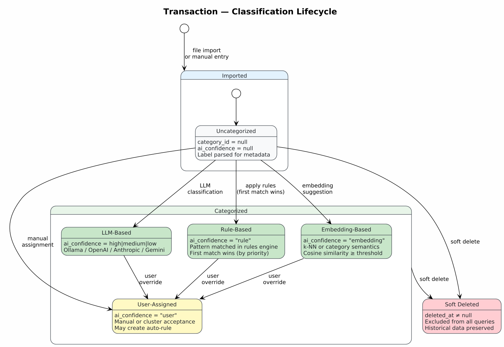

<details>
<summary>PlantUML source</summary>

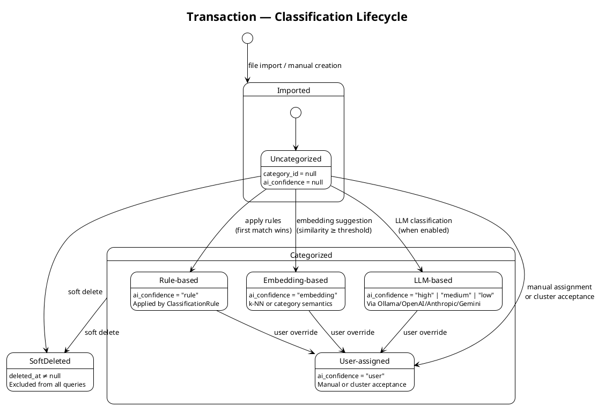

</details>

### 1c. Classification Proposal Workflow

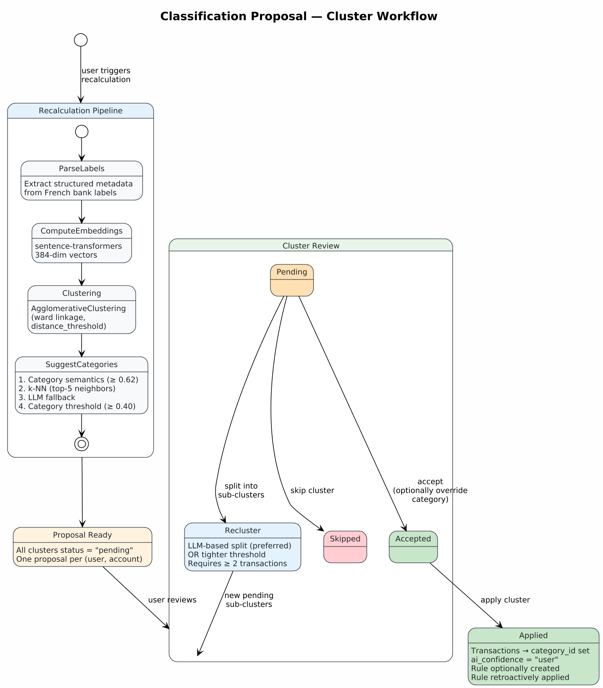

<details>
<summary>PlantUML source</summary>

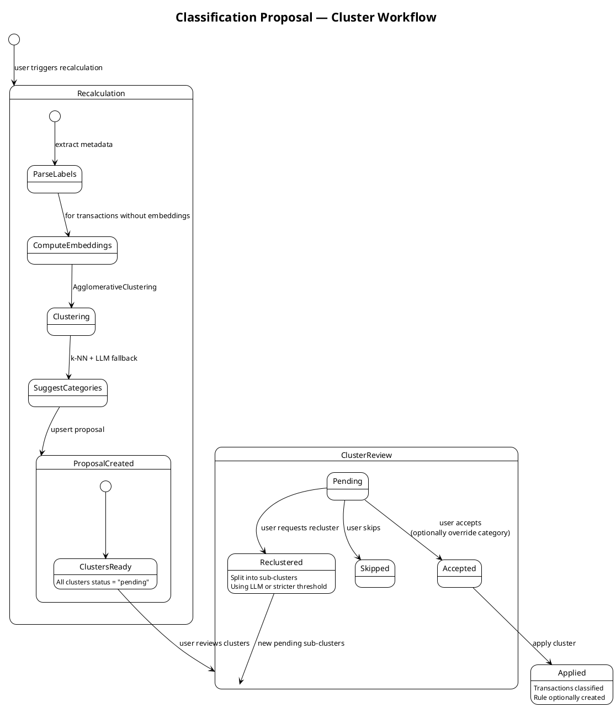

</details>

### 1d. Account Status State Diagram

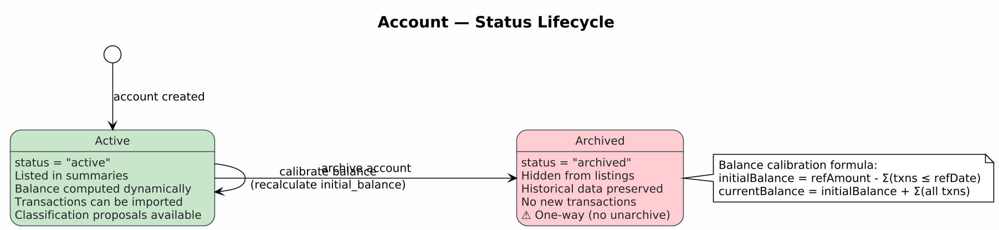

<details>
<summary>PlantUML source</summary>

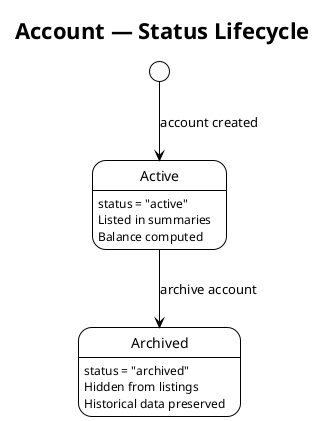

</details>

### 1e. Import Workflow State Diagram

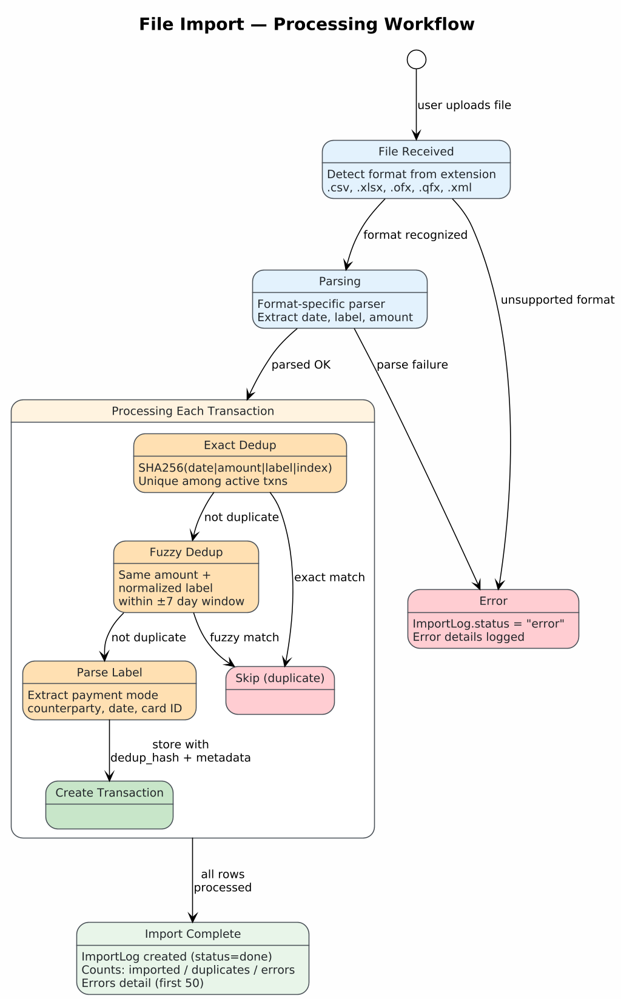

<details>
<summary>PlantUML source</summary>

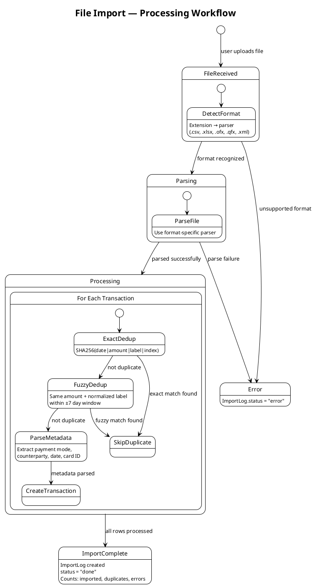

</details>

---

### 1f. Persistent TransactionCluster Model

> TransactionCluster is a first-class persistent entity, separate from the ephemeral ClassificationProposalCluster used during proposal review.

| Aspect | Implementation |
|--------|---------------|
| **TransactionCluster as persistent entity** | Separate `transaction_clusters` table with `user_id`, `account_id`, `name`, `description`, `category_id` |
| **Transaction.cluster_id** | FK to `transaction_clusters` with `ondelete=SET NULL` |
| **Cluster ← Rule link (bidirectional)** | `TransactionCluster.rule_id` FK (cluster → rule) AND `ClassificationRule.cluster_id` FK (rule → cluster). Enables linked proposals on recalculation. |
| **Cluster ← Proposal link** | `TransactionCluster.proposal_cluster_id` FK to the source proposal cluster |
| **ProposalCluster → TC link** | `ClassificationProposalCluster.transaction_cluster_id` FK to existing TC. Set when rule with `cluster_id` matched txns. Null for new patterns. |
| **Cluster source tracking** | `source ∈ {classification, rule, manual}` — tracks how the cluster was created |
| **Rich statistics** | Amount aggregations (total, avg, min, max, stddev), frequency (avg_days_between, is_recurring, recurrence_pattern), outlier detection (IQR), trend detection (linear regression) |
| **Rules classify only** | `apply_rules()` sets `category_id` on matched transactions. Does NOT auto-create clusters. Cluster assignment is via proposal review. |
| **Linked proposals** | During recalculation, rules with `cluster_id` generate linked ProposalClusters. On confirm, txns merge into existing TC. "Detach" creates new TC instead. |
| **Category hierarchy** | `Category.level` (1/2/3), `level1_id`, `level2_id` — denormalized navigation fields |
| **ProposalCluster.excludedIds** | JSONB list of excluded transaction IDs during proposal review |
| **ProposalCluster.customLabel** | User-defined label override for a proposal cluster |
| **UserSession** | Entity for session management (token JTI, device info, fingerprint) |
| **Two-entity architecture** | `ClassificationProposalCluster` (ephemeral, for UI review) → creates `TransactionCluster` (persistent) on accept |

---

## 2. Platform Specific Model (PSM) — Component Architecture

> **PSM overview**: Maps the domain model onto the concrete technology stack. Shows how React frontend, FastAPI backend, PostgreSQL + pgvector database, and AI/ML services interact as deployable components.

### Architecture Diagram

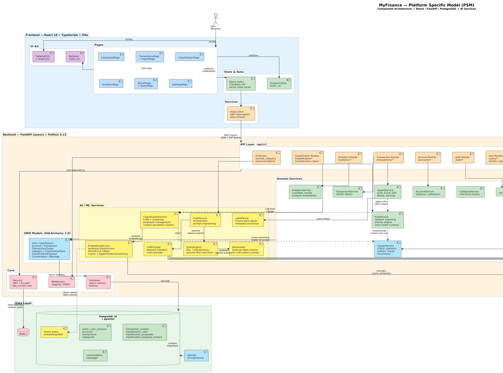

<details>
<summary>PlantUML source</summary>

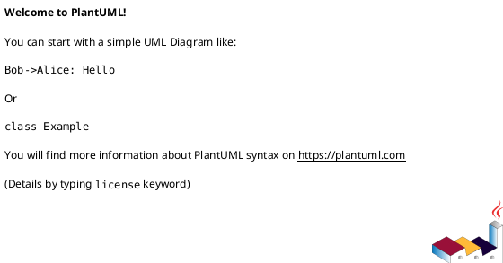

</details>

### Technology Matrix

| Layer | Technologies | Role |
|-------|-------------|------|
| **Frontend** | React 18, TypeScript, Vite 5 | SPA with client-side routing |
| **State** | Zustand (auth, ui) + React Query v5 (server cache) | Minimal client state, 5-min server cache |
| **UI** | TailwindCSS + shadcn/ui + Recharts | Design system, data visualization |
| **API Client** | Axios + JWT interceptors | Auto-attach Bearer, auto-refresh on 401 |
| **Backend** | FastAPI (async), Python 3.12, Pydantic v2 | REST API `/api/v1`, async-first |
| **Auth** | JWT (HS256, python-jose) + bcrypt | 30-min access token, 7-day refresh |
| **ORM** | SQLAlchemy 2.0 (async) + Alembic | Async sessions via asyncpg, 9 migrations |
| **Database** | PostgreSQL 16 + pgvector | Relational + vector similarity search |
| **Cache** | Redis 7 | Token blacklist, session cache |
| **Embeddings** | sentence-transformers (MiniLM-L12-v2, 384d) | Local model, cosine + AgglomerativeClustering |
| **LLM** | Multi-provider: Ollama / OpenAI / Anthropic / Gemini | Chat assistant, category interpretation, dataviz DSL |
| **Infra** | Docker Compose (4 services), Uvicorn, Nginx | db + redis + backend + frontend |

### Component Breakdown

#### Frontend (React 18 + TypeScript + Vite)

| Component | Responsibility |
|-----------|---------------|
| **Pages** | DashboardPage, TransactionsPage, ClassificationPage, AnalyticsPage, AIChatPage + QueryPage, SettingsPage, **AccountPage (Mon compte)** |
| **Zustand Store** | `auth.store` (user, tokens, isAuthenticated), `ui.store` (sidebar, modals) |
| **React Query** | Server state cache, auto-refetch on focus, mutation → invalidation |
| **Axios Client** | Base URL `/api/v1`, request interceptor (JWT), response interceptor (401 → refresh) |
| **Recharts** | Cashflow charts, category breakdowns, trend visualizations |

#### Backend (FastAPI + Python 3.12)

**API Routes** (`/api/v1`):

| Route Group | Endpoints | Service |
|-------------|-----------|---------|
| `/auth/*` | register, login, refresh | AuthService |
| `/accounts/*` | CRUD, balance | AccountService |
| `/transactions/*` | CRUD, import, parse-labels | TransactionService, ImportService |
| `/classification/*` | proposals, recalculate, apply | ClassificationService |
| `/classification-rules/*` | CRUD | RuleService |
| **`/clusters/*`** | **CRUD, suggest-pattern, create-from-selection, move-txns, recompute-stats, delete-empty** | **ClusterService** |
| `/analytics/*` | summary, trends | AnalyticsService |
| `/ai/*` | chat, conversations, query, config, metamodel | ChatService, QueryEngine |
| `/categories/*` | CRUD, hierarchy | CategoryService |
| **`/users/*`** | **profile, password, sessions (list/revoke)** | **UserService, SessionService** |
| **`/export-import/*`** | **export/import categories+rules as YAML** | **ExportImportService** |

**Domain Services**:

| Service | Responsibility |
|---------|---------------|
| **ImportService** | Parse CSV/Excel/OFX, SHA256 dedup + fuzzy matching (±7 days), label extraction |
| **RuleService** | Pattern matching (contains/exact/starts_with), priority engine, auto-apply on import. Rules only classify (set `category_id`), no auto-cluster creation. Returns `rule_matches` for linked proposal generation. |
| **ClassificationService** | Embedding clustering (AgglomerativeClustering), proposal management, k-NN classification, **creates persistent TransactionCluster on accept**. Generates linked ProposalClusters for rules with `cluster_id`. Supports merge-into-TC and detach workflows. |
| **EmbeddingService** | sentence-transformers encode(), cosine similarity, cluster detection |
| **ClusterService** | **CRUD for persistent TransactionCluster, statistics recomputation (amount/frequency/outliers/trends), suggest-pattern, create-from-selection, move transactions** |
| **ChatService** | LLM orchestration, prompt engineering, dataviz block parsing |
| **QueryEngine** | DSL → SQLAlchemy compiler, security-first (user_id injected server-side), max 1000 rows |
| **Metamodel** | **Financial data schema for AI: sources, fields, relationships, temporal functions, aggregators — injected into LLM system prompt** |
| **LLMProvider** | Abstract interface: OllamaChatProvider, OpenAIChatProvider, AnthropicChatProvider, GeminiChatProvider |
| **LabelParser** | French bank label parsing (VIREMENT SEPA, CB, PRELEVEMENT...) → structured metadata |
| **SessionService** | **User session management: list active sessions, revoke tokens, device fingerprinting** |
| **ExportImportService** | **Export/import categories + classification rules as YAML (backup, sharing, account recreation)** |
| **CategoryService** | **Category CRUD, hierarchy levels computation (level1/level2 denormalization)** |
| **UserService** | **Profile management, password change, account deletion** |

#### Data Layer

| Component | Details |
|-----------|---------|
| **PostgreSQL 16** | Core tables: users, **user_sessions**, accounts, transactions, **transaction_clusters**, categories, classification_rules, classification_proposals, classification_proposal_clusters, conversations, messages |
| **pgvector** | `embedding Vector(384)` on transactions table, enables semantic similarity search |
| **Redis 7** | Token blacklist, session cache |
| **Alembic** | 9 migration versions (users → core tables → embeddings → proposals → conversations) |

### Key Data Flows

```
Import Flow:
  CSV/Excel/OFX → ImportService → dedup → LabelParser → RuleService
  → auto-categorize (set category_id only, no auto-cluster creation)
  → remaining uncategorized → wait for recalculate

Classification Flow:
  Recalculate → apply_rules (classify only, return rule_matches)
  → LabelParser → EmbeddingService.encode() → AgglomerativeClustering
  → linked ProposalClusters (rules with cluster_id) + unlinked (new patterns)
  → user reviews → confirm linked → merge into existing TC
  → confirm unlinked → create new TC + optional rule with cluster_id
  → ClusterService.recompute_statistics()

Cluster Statistics Flow:
  ClusterService.recompute_statistics(cluster_id) → load member transactions
  → compute: total/avg/min/max/stddev amount, avg_days_between,
  → IQR outlier detection, linear regression trend, recurrence pattern
  → store in TransactionCluster fields + statistics JSONB

Chat Flow:
  User message → ChatService → FinancialContext → LLMProvider.chat()
  → parse dataviz blocks → QueryEngine validates against Metamodel
  → QueryEngine.execute() → response + charts

Query Flow:
  LLM generates {query: DSL, viz: spec} → QueryEngine validates metamodel
  → compiles to SQLAlchemy Select → injects user_id security context
  → async execute → flat rows → frontend Recharts
```

---

## 3. RDF/OWL Ontology (Turtle Syntax)

### Ontology Knowledge Graph

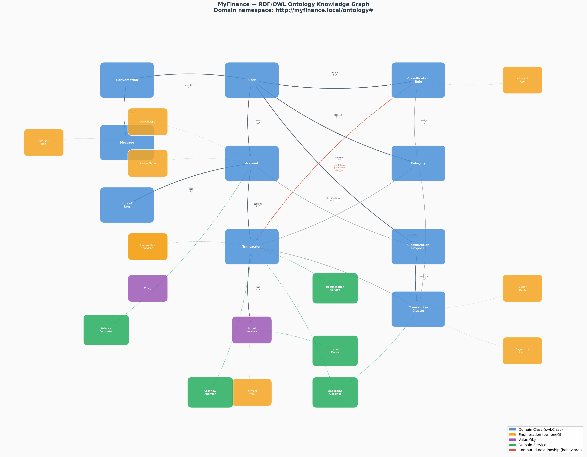

<details>
<summary>Turtle/RDF source</summary>

```turtle
@prefix owl:    <http://www.w3.org/2002/07/owl#> .
@prefix rdf:    <http://www.w3.org/1999/02/22-rdf-syntax-ns#> .
@prefix rdfs:   <http://www.w3.org/2000/01/rdf-schema#> .
@prefix xsd:    <http://www.w3.org/2001/XMLSchema#> .
@prefix dc:     <http://purl.org/dc/elements/1.1/> .
@prefix mf:     <http://myfinance.local/ontology#> .

# ══════════════════════════════════════════════════════════
# ONTOLOGY HEADER
# ══════════════════════════════════════════════════════════

<http://myfinance.local/ontology>
    a owl:Ontology ;
    dc:title "MyFinance Domain Ontology"@en ;
    dc:description "Platform Independent Model for a personal finance management application with AI-powered transaction classification."@en ;
    owl:versionInfo "1.0" .

# ══════════════════════════════════════════════════════════
# CLASSES
# ══════════════════════════════════════════════════════════

# ── Core Domain Entities ─────────────────────────────────

mf:User
    a owl:Class ;
    rdfs:label "User"@en ;
    rdfs:label "Utilisateur"@fr ;
    rdfs:comment "A person who uses the application to manage their personal finances. Multi-tenant: each user sees only their own data."@en .

mf:Account
    a owl:Class ;
    rdfs:label "Bank Account"@en ;
    rdfs:label "Compte bancaire"@fr ;
    rdfs:comment "A financial account (checking, savings, credit card, investment) belonging to a user. Tracks transactions and computes balances."@en .

mf:Transaction
    a owl:Class ;
    rdfs:label "Financial Transaction"@en ;
    rdfs:label "Transaction financière"@fr ;
    rdfs:comment "A single monetary movement on an account. Positive amount = income, negative = expense. Carries raw bank label, optional cleaned label, classification, and embedding vector."@en .

mf:Category
    a owl:Class ;
    rdfs:label "Expense Category"@en ;
    rdfs:label "Catégorie de dépense"@fr ;
    rdfs:comment "A classification category for transactions. Can be system-defined (shared) or user-created. Supports parent-child hierarchy."@en .

mf:ClassificationRule
    a owl:Class ;
    rdfs:label "Classification Rule"@en ;
    rdfs:label "Règle de classification"@fr ;
    rdfs:comment "A pattern-matching rule that automatically assigns a category to transactions whose label matches. Evaluated by priority (highest first); first match wins."@en .

mf:ImportLog
    a owl:Class ;
    rdfs:label "Import Log"@en ;
    rdfs:label "Journal d'import"@fr ;
    rdfs:comment "Audit record of a file import operation. Tracks the file, format, and outcome (imported, duplicates, errors)."@en .

mf:ClassificationProposal
    a owl:Class ;
    rdfs:label "Classification Proposal"@en ;
    rdfs:label "Proposition de classification"@fr ;
    rdfs:comment "An AI-generated set of transaction clusters for a specific (user, account) pair. One proposal per account. Contains clusters of similar uncategorized transactions with suggested categories."@en .

mf:TransactionCluster
    a owl:Class ;
    rdfs:label "Transaction Cluster"@en ;
    rdfs:label "Groupe de transactions"@fr ;
    rdfs:comment "A group of semantically similar uncategorized transactions, identified by embedding-based clustering. Carries an AI-suggested category that the user can accept, override, or skip."@en .

mf:Conversation
    a owl:Class ;
    rdfs:label "Conversation"@en ;
    rdfs:label "Conversation"@fr ;
    rdfs:comment "A chat conversation between a user and the AI financial assistant. Contains an ordered sequence of messages."@en .

mf:Message
    a owl:Class ;
    rdfs:label "Chat Message"@en ;
    rdfs:label "Message"@fr ;
    rdfs:comment "A single message in a conversation. Role is user, assistant, or system."@en .

# ── Value Objects ────────────────────────────────────────

mf:ParsedMetadata
    a owl:Class ;
    rdfs:label "Parsed Label Metadata"@en ;
    rdfs:label "Métadonnées extraites du libellé"@fr ;
    rdfs:comment "Structured metadata extracted from a raw French bank transaction label: payment mode, counterparty, operation date, card ID, etc."@en .

mf:Money
    a owl:Class ;
    rdfs:label "Monetary Amount"@en ;
    rdfs:comment "A decimal amount with 2-digit precision (Decimal 12,2). Positive represents income/credit, negative represents expense/debit."@en .

mf:CashflowItem
    a owl:Class ;
    rdfs:label "Cashflow Item"@en ;
    rdfs:label "Élément de trésorerie"@fr ;
    rdfs:comment "Aggregated income, expenses, and net for a time period (month or day)."@en .

mf:CategoryBreakdown
    a owl:Class ;
    rdfs:label "Category Breakdown"@en ;
    rdfs:label "Répartition par catégorie"@fr ;
    rdfs:comment "Aggregated total, count, and percentage of transactions for a given category within a time period."@en .

# ── Enumerations as Named Individuals ───────────────────

# Account Types
mf:AccountType a owl:Class ;
    rdfs:label "Account Type"@en ;
    owl:oneOf (mf:Courant mf:Epargne mf:Carte mf:Invest) .

mf:Courant a mf:AccountType ; rdfs:label "Compte courant (Checking)"@en .
mf:Epargne a mf:AccountType ; rdfs:label "Compte épargne (Savings)"@en .
mf:Carte   a mf:AccountType ; rdfs:label "Carte de crédit (Credit Card)"@en .
mf:Invest  a mf:AccountType ; rdfs:label "Compte investissement (Investment)"@en .

# Account Status
mf:AccountStatus a owl:Class ;
    rdfs:label "Account Status"@en ;
    owl:oneOf (mf:Active mf:Archived) .

mf:Active   a mf:AccountStatus ; rdfs:label "Active"@en .
mf:Archived a mf:AccountStatus ; rdfs:label "Archived"@en .

# Transaction Source
mf:TransactionSource a owl:Class ;
    rdfs:label "Transaction Source"@en ;
    owl:oneOf (mf:ImportCSV mf:ImportExcel mf:ImportOFX mf:Manual) .

mf:ImportCSV   a mf:TransactionSource ; rdfs:label "CSV Import"@en .
mf:ImportExcel a mf:TransactionSource ; rdfs:label "Excel Import"@en .
mf:ImportOFX   a mf:TransactionSource ; rdfs:label "OFX/QFX Import"@en .
mf:Manual      a mf:TransactionSource ; rdfs:label "Manual Entry"@en .

# Classification Confidence
mf:ClassificationConfidence a owl:Class ;
    rdfs:label "Classification Confidence Level"@en ;
    owl:oneOf (mf:ConfidenceHigh mf:ConfidenceMedium mf:ConfidenceLow mf:ConfidenceRule mf:ConfidenceUser mf:ConfidenceEmbedding) .

mf:ConfidenceHigh      a mf:ClassificationConfidence ; rdfs:label "High (similarity ≥ 0.85)"@en .
mf:ConfidenceMedium    a mf:ClassificationConfidence ; rdfs:label "Medium (similarity ≥ 0.70)"@en .
mf:ConfidenceLow       a mf:ClassificationConfidence ; rdfs:label "Low (similarity ≥ 0.55)"@en .
mf:ConfidenceRule      a mf:ClassificationConfidence ; rdfs:label "Rule-based"@en .
mf:ConfidenceUser      a mf:ClassificationConfidence ; rdfs:label "User-assigned"@en .
mf:ConfidenceEmbedding a mf:ClassificationConfidence ; rdfs:label "Embedding-based"@en .

# Payment Type
mf:PaymentType a owl:Class ;
    rdfs:label "Payment Type"@en ;
    owl:oneOf (mf:Card mf:Transfer mf:TransferIn mf:DirectDebit mf:ATM mf:Check mf:CheckDeposit mf:Fee mf:Subscription mf:Refund mf:Credit) .

mf:Card         a mf:PaymentType ; rdfs:label "Card payment (CB)"@en .
mf:Transfer     a mf:PaymentType ; rdfs:label "Wire transfer (Virement)"@en .
mf:TransferIn   a mf:PaymentType ; rdfs:label "Incoming transfer"@en .
mf:DirectDebit  a mf:PaymentType ; rdfs:label "Direct debit (Prélèvement)"@en .
mf:ATM          a mf:PaymentType ; rdfs:label "ATM withdrawal (Retrait)"@en .
mf:Check        a mf:PaymentType ; rdfs:label "Check (Chèque)"@en .
mf:CheckDeposit a mf:PaymentType ; rdfs:label "Check deposit"@en .
mf:Fee          a mf:PaymentType ; rdfs:label "Bank fee (Frais)"@en .
mf:Subscription a mf:PaymentType ; rdfs:label "Subscription (Abonnement)"@en .
mf:Refund       a mf:PaymentType ; rdfs:label "Refund (Remboursement)"@en .
mf:Credit       a mf:PaymentType ; rdfs:label "Credit (Avoir)"@en .

# Rule Match Type
mf:RuleMatchType a owl:Class ;
    rdfs:label "Rule Match Type"@en ;
    owl:oneOf (mf:Contains mf:Exact mf:StartsWith) .

mf:Contains   a mf:RuleMatchType ; rdfs:label "Contains (substring)"@en .
mf:Exact      a mf:RuleMatchType ; rdfs:label "Exact match"@en .
mf:StartsWith a mf:RuleMatchType ; rdfs:label "Starts with (prefix)"@en .

# Cluster Status
mf:ClusterStatus a owl:Class ;
    rdfs:label "Cluster Review Status"@en ;
    owl:oneOf (mf:ClusterPending mf:ClusterAccepted mf:ClusterSkipped) .

mf:ClusterPending  a mf:ClusterStatus ; rdfs:label "Pending review"@en .
mf:ClusterAccepted a mf:ClusterStatus ; rdfs:label "Accepted by user"@en .
mf:ClusterSkipped  a mf:ClusterStatus ; rdfs:label "Skipped by user"@en .

# Suggestion Source
mf:SuggestionSource a owl:Class ;
    rdfs:label "Category Suggestion Source"@en ;
    owl:oneOf (mf:SimilarTransactions mf:CategorySemantics mf:LLM) .

mf:SimilarTransactions a mf:SuggestionSource ; rdfs:label "k-NN on similar classified transactions"@en .
mf:CategorySemantics   a mf:SuggestionSource ; rdfs:label "Category name embedding similarity"@en .
mf:LLM                 a mf:SuggestionSource ; rdfs:label "Large Language Model classification"@en .

# Message Role
mf:MessageRole a owl:Class ;
    rdfs:label "Message Role"@en ;
    owl:oneOf (mf:RoleUser mf:RoleAssistant mf:RoleSystem) .

mf:RoleUser      a mf:MessageRole ; rdfs:label "User message"@en .
mf:RoleAssistant a mf:MessageRole ; rdfs:label "Assistant response"@en .
mf:RoleSystem    a mf:MessageRole ; rdfs:label "System prompt"@en .

# Import Status
mf:ImportStatus a owl:Class ;
    rdfs:label "Import Status"@en ;
    owl:oneOf (mf:ImportPending mf:ImportProcessing mf:ImportDone mf:ImportError) .

mf:ImportPending    a mf:ImportStatus ; rdfs:label "Pending"@en .
mf:ImportProcessing a mf:ImportStatus ; rdfs:label "Processing"@en .
mf:ImportDone       a mf:ImportStatus ; rdfs:label "Done"@en .
mf:ImportError      a mf:ImportStatus ; rdfs:label "Error"@en .


# ══════════════════════════════════════════════════════════
# OBJECT PROPERTIES (Relationships)
# ══════════════════════════════════════════════════════════

mf:ownsAccount
    a owl:ObjectProperty ;
    rdfs:label "owns account"@en ;
    rdfs:comment "A user owns zero or more bank accounts."@en ;
    rdfs:domain mf:User ;
    rdfs:range mf:Account .

mf:belongsToUser
    a owl:ObjectProperty ;
    rdfs:label "belongs to user"@en ;
    rdfs:comment "An account belongs to exactly one user."@en ;
    rdfs:domain mf:Account ;
    rdfs:range mf:User ;
    owl:inverseOf mf:ownsAccount .

mf:containsTransaction
    a owl:ObjectProperty ;
    rdfs:label "contains transaction"@en ;
    rdfs:comment "An account contains zero or more transactions."@en ;
    rdfs:domain mf:Account ;
    rdfs:range mf:Transaction .

mf:inAccount
    a owl:ObjectProperty ;
    rdfs:label "in account"@en ;
    rdfs:comment "A transaction belongs to exactly one account."@en ;
    rdfs:domain mf:Transaction ;
    rdfs:range mf:Account ;
    owl:inverseOf mf:containsTransaction .

mf:classifiedAs
    a owl:ObjectProperty ;
    rdfs:label "classified as"@en ;
    rdfs:comment "A transaction is optionally classified into a category."@en ;
    rdfs:domain mf:Transaction ;
    rdfs:range mf:Category .

mf:hasParentCategory
    a owl:ObjectProperty ;
    rdfs:label "has parent category"@en ;
    rdfs:comment "A category may have a parent category (hierarchical taxonomy)."@en ;
    rdfs:domain mf:Category ;
    rdfs:range mf:Category .

mf:createsCategory
    a owl:ObjectProperty ;
    rdfs:label "creates category"@en ;
    rdfs:comment "A user creates custom categories. System categories have no user owner."@en ;
    rdfs:domain mf:User ;
    rdfs:range mf:Category .

mf:definesRule
    a owl:ObjectProperty ;
    rdfs:label "defines rule"@en ;
    rdfs:comment "A user defines classification rules."@en ;
    rdfs:domain mf:User ;
    rdfs:range mf:ClassificationRule .

mf:ruleAssignsCategory
    a owl:ObjectProperty ;
    rdfs:label "assigns category"@en ;
    rdfs:comment "A classification rule assigns a specific category to matching transactions."@en ;
    rdfs:domain mf:ClassificationRule ;
    rdfs:range mf:Category .

mf:hasImportLog
    a owl:ObjectProperty ;
    rdfs:label "has import log"@en ;
    rdfs:comment "An account has zero or more import logs."@en ;
    rdfs:domain mf:Account ;
    rdfs:range mf:ImportLog .

mf:hasProposal
    a owl:ObjectProperty ;
    rdfs:label "has classification proposal"@en ;
    rdfs:comment "An account has at most one active classification proposal."@en ;
    rdfs:domain mf:Account ;
    rdfs:range mf:ClassificationProposal .

mf:proposalForUser
    a owl:ObjectProperty ;
    rdfs:label "proposal for user"@en ;
    rdfs:comment "A classification proposal is generated for a specific user."@en ;
    rdfs:domain mf:ClassificationProposal ;
    rdfs:range mf:User .

mf:containsCluster
    a owl:ObjectProperty ;
    rdfs:label "contains cluster"@en ;
    rdfs:comment "A classification proposal contains zero or more transaction clusters."@en ;
    rdfs:domain mf:ClassificationProposal ;
    rdfs:range mf:TransactionCluster .

mf:groupsTransaction
    a owl:ObjectProperty ;
    rdfs:label "groups transaction"@en ;
    rdfs:comment "A transaction cluster groups one or more transactions identified as semantically similar. Stored as a denormalized JSONB array of transaction IDs."@en ;
    rdfs:domain mf:TransactionCluster ;
    rdfs:range mf:Transaction .

mf:matchesTransaction
    a owl:ObjectProperty ;
    rdfs:label "matches transaction"@en ;
    rdfs:comment "A classification rule matches transactions whose label_raw satisfies the pattern (contains, exact, or starts_with). This is a computed, behavioral relationship — no FK exists. When applied, the matched transaction receives the rule's category and ai_confidence='rule'."@en ;
    rdfs:domain mf:ClassificationRule ;
    rdfs:range mf:Transaction .

mf:producesRule
    a owl:ObjectProperty ;
    rdfs:label "produces rule"@en ;
    rdfs:comment "When a user accepts a transaction cluster (with create_rule=True), a ClassificationRule is created or updated. The rule's pattern is derived from the cluster's rule_pattern (user override) or the first transaction's label_raw. This is a unidirectional, event-driven relationship — the rule has no back-reference to the cluster that produced it."@en ;
    rdfs:domain mf:TransactionCluster ;
    rdfs:range mf:ClassificationRule .

mf:suggestedCategory
    a owl:ObjectProperty ;
    rdfs:label "suggested category"@en ;
    rdfs:comment "The AI-suggested category for a transaction cluster."@en ;
    rdfs:domain mf:TransactionCluster ;
    rdfs:range mf:Category .

mf:overriddenCategory
    a owl:ObjectProperty ;
    rdfs:label "overridden category"@en ;
    rdfs:comment "The user-overridden category for a cluster (replaces the AI suggestion)."@en ;
    rdfs:domain mf:TransactionCluster ;
    rdfs:range mf:Category .

mf:hasParsedMetadata
    a owl:ObjectProperty ;
    rdfs:label "has parsed metadata"@en ;
    rdfs:comment "A transaction may carry structured metadata parsed from its raw label."@en ;
    rdfs:domain mf:Transaction ;
    rdfs:range mf:ParsedMetadata .

mf:initiatesConversation
    a owl:ObjectProperty ;
    rdfs:label "initiates conversation"@en ;
    rdfs:comment "A user initiates zero or more conversations with the AI assistant."@en ;
    rdfs:domain mf:User ;
    rdfs:range mf:Conversation .

mf:containsMessage
    a owl:ObjectProperty ;
    rdfs:label "contains message"@en ;
    rdfs:comment "A conversation contains an ordered sequence of messages."@en ;
    rdfs:domain mf:Conversation ;
    rdfs:range mf:Message .


# ══════════════════════════════════════════════════════════
# DATATYPE PROPERTIES (Attributes)
# ══════════════════════════════════════════════════════════

# ── User ─────────────────────────────────────────────────

mf:email
    a owl:DatatypeProperty, owl:FunctionalProperty ;
    rdfs:label "email address"@en ;
    rdfs:comment "Unique email address used for authentication."@en ;
    rdfs:domain mf:User ;
    rdfs:range xsd:string .

mf:fullName
    a owl:DatatypeProperty ;
    rdfs:label "full name"@en ;
    rdfs:domain mf:User ;
    rdfs:range xsd:string .

mf:isActive
    a owl:DatatypeProperty ;
    rdfs:label "is active"@en ;
    rdfs:comment "Whether the user account is active. Inactive users cannot log in."@en ;
    rdfs:domain mf:User ;
    rdfs:range xsd:boolean .

mf:isAdmin
    a owl:DatatypeProperty ;
    rdfs:label "is admin"@en ;
    rdfs:domain mf:User ;
    rdfs:range xsd:boolean .

# ── Account ──────────────────────────────────────────────

mf:accountName
    a owl:DatatypeProperty ;
    rdfs:label "account name"@en ;
    rdfs:domain mf:Account ;
    rdfs:range xsd:string .

mf:accountType
    a owl:ObjectProperty ;
    rdfs:label "account type"@en ;
    rdfs:comment "Type of financial account: checking (courant), savings (épargne), credit card (carte), or investment (invest)."@en ;
    rdfs:domain mf:Account ;
    rdfs:range mf:AccountType .

mf:currency
    a owl:DatatypeProperty ;
    rdfs:label "currency code"@en ;
    rdfs:comment "ISO 4217 currency code, default EUR."@en ;
    rdfs:domain mf:Account ;
    rdfs:range xsd:string .

mf:bankName
    a owl:DatatypeProperty ;
    rdfs:label "bank name"@en ;
    rdfs:domain mf:Account ;
    rdfs:range xsd:string .

mf:initialBalance
    a owl:DatatypeProperty ;
    rdfs:label "initial balance"@en ;
    rdfs:comment "Starting balance of the account. May be back-calculated via calibration."@en ;
    rdfs:domain mf:Account ;
    rdfs:range xsd:decimal .

mf:currentBalance
    a owl:DatatypeProperty ;
    rdfs:label "current balance"@en ;
    rdfs:comment "Derived: initialBalance + sum of all transaction amounts. Not persisted."@en ;
    rdfs:domain mf:Account ;
    rdfs:range xsd:decimal .

mf:accountStatus
    a owl:ObjectProperty ;
    rdfs:label "account status"@en ;
    rdfs:domain mf:Account ;
    rdfs:range mf:AccountStatus .

mf:balanceReferenceDate
    a owl:DatatypeProperty ;
    rdfs:label "balance reference date"@en ;
    rdfs:comment "Date at which a known balance was provided for calibration."@en ;
    rdfs:domain mf:Account ;
    rdfs:range xsd:date .

mf:balanceReferenceAmount
    a owl:DatatypeProperty ;
    rdfs:label "balance reference amount"@en ;
    rdfs:comment "The known balance at the reference date, used for calibration."@en ;
    rdfs:domain mf:Account ;
    rdfs:range xsd:decimal .

# ── Transaction ──────────────────────────────────────────

mf:transactionDate
    a owl:DatatypeProperty ;
    rdfs:label "transaction date"@en ;
    rdfs:domain mf:Transaction ;
    rdfs:range xsd:date .

mf:valueDate
    a owl:DatatypeProperty ;
    rdfs:label "value date"@en ;
    rdfs:comment "The date at which the transaction actually affects the balance (may differ from booking date)."@en ;
    rdfs:domain mf:Transaction ;
    rdfs:range xsd:date .

mf:labelRaw
    a owl:DatatypeProperty ;
    rdfs:label "raw label"@en ;
    rdfs:comment "The original bank label as imported. Up to 500 characters."@en ;
    rdfs:domain mf:Transaction ;
    rdfs:range xsd:string .

mf:labelClean
    a owl:DatatypeProperty ;
    rdfs:label "clean label"@en ;
    rdfs:comment "An optional user-assigned or rule-derived clean label for display."@en ;
    rdfs:domain mf:Transaction ;
    rdfs:range xsd:string .

mf:amount
    a owl:DatatypeProperty ;
    rdfs:label "amount"@en ;
    rdfs:comment "Monetary amount with sign. Positive = income, negative = expense."@en ;
    rdfs:domain mf:Transaction ;
    rdfs:range xsd:decimal .

mf:subcategory
    a owl:DatatypeProperty ;
    rdfs:label "subcategory"@en ;
    rdfs:domain mf:Transaction ;
    rdfs:range xsd:string .

mf:notes
    a owl:DatatypeProperty ;
    rdfs:label "notes"@en ;
    rdfs:domain mf:Transaction ;
    rdfs:range xsd:string .

mf:tags
    a owl:DatatypeProperty ;
    rdfs:label "tags"@en ;
    rdfs:comment "Free-form user tags for transaction annotation."@en ;
    rdfs:domain mf:Transaction ;
    rdfs:range xsd:string .

mf:dedupHash
    a owl:DatatypeProperty, owl:FunctionalProperty ;
    rdfs:label "deduplication hash"@en ;
    rdfs:comment "SHA256 hash of (date|amount|label|index) for import deduplication. Unique among non-deleted transactions."@en ;
    rdfs:domain mf:Transaction ;
    rdfs:range xsd:string .

mf:source
    a owl:ObjectProperty ;
    rdfs:label "transaction source"@en ;
    rdfs:domain mf:Transaction ;
    rdfs:range mf:TransactionSource .

mf:classificationConfidence
    a owl:ObjectProperty ;
    rdfs:label "classification confidence"@en ;
    rdfs:comment "The method/confidence level of the classification: high, medium, low (AI), rule, user, embedding."@en ;
    rdfs:domain mf:Transaction ;
    rdfs:range mf:ClassificationConfidence .

mf:embedding
    a owl:DatatypeProperty ;
    rdfs:label "embedding vector"@en ;
    rdfs:comment "384-dimensional vector computed by sentence-transformers for semantic similarity. Used for clustering and k-NN classification."@en ;
    rdfs:domain mf:Transaction ;
    rdfs:range xsd:string .

# ── Category ─────────────────────────────────────────────

mf:categoryName
    a owl:DatatypeProperty ;
    rdfs:label "category name"@en ;
    rdfs:domain mf:Category ;
    rdfs:range xsd:string .

mf:icon
    a owl:DatatypeProperty ;
    rdfs:label "icon"@en ;
    rdfs:domain mf:Category ;
    rdfs:range xsd:string .

mf:color
    a owl:DatatypeProperty ;
    rdfs:label "color"@en ;
    rdfs:comment "Hex color code for display."@en ;
    rdfs:domain mf:Category ;
    rdfs:range xsd:string .

mf:isSystem
    a owl:DatatypeProperty ;
    rdfs:label "is system category"@en ;
    rdfs:comment "System categories are shared across all users and cannot be modified or deleted."@en ;
    rdfs:domain mf:Category ;
    rdfs:range xsd:boolean .

# ── Classification Rule ──────────────────────────────────

mf:pattern
    a owl:DatatypeProperty ;
    rdfs:label "matching pattern"@en ;
    rdfs:comment "The text pattern to match against transaction labels."@en ;
    rdfs:domain mf:ClassificationRule ;
    rdfs:range xsd:string .

mf:matchType
    a owl:ObjectProperty ;
    rdfs:label "match type"@en ;
    rdfs:domain mf:ClassificationRule ;
    rdfs:range mf:RuleMatchType .

mf:customLabel
    a owl:DatatypeProperty ;
    rdfs:label "custom label"@en ;
    rdfs:comment "Optional clean label to apply when the rule matches."@en ;
    rdfs:domain mf:ClassificationRule ;
    rdfs:range xsd:string .

mf:priority
    a owl:DatatypeProperty ;
    rdfs:label "rule priority"@en ;
    rdfs:comment "Higher values are evaluated first. Rules are applied in priority DESC order."@en ;
    rdfs:domain mf:ClassificationRule ;
    rdfs:range xsd:integer .

mf:ruleIsActive
    a owl:DatatypeProperty ;
    rdfs:label "rule is active"@en ;
    rdfs:domain mf:ClassificationRule ;
    rdfs:range xsd:boolean .

mf:createdBy
    a owl:ObjectProperty ;
    rdfs:label "created by"@en ;
    rdfs:comment "Origin of the rule: manual (user-created) or ai (auto-generated)."@en ;
    rdfs:domain mf:ClassificationRule ;
    rdfs:range mf:RuleOrigin .

# ── Conversation / Message ───────────────────────────────

mf:conversationTitle
    a owl:DatatypeProperty ;
    rdfs:label "conversation title"@en ;
    rdfs:domain mf:Conversation ;
    rdfs:range xsd:string .

mf:messageRole
    a owl:ObjectProperty ;
    rdfs:label "message role"@en ;
    rdfs:domain mf:Message ;
    rdfs:range mf:MessageRole .

mf:messageContent
    a owl:DatatypeProperty ;
    rdfs:label "message content"@en ;
    rdfs:domain mf:Message ;
    rdfs:range xsd:string .

# ── Cluster ──────────────────────────────────────────────

mf:representativeLabel
    a owl:DatatypeProperty ;
    rdfs:label "representative label"@en ;
    rdfs:comment "The most frequent counterparty/label in the cluster, used as a summary."@en ;
    rdfs:domain mf:TransactionCluster ;
    rdfs:range xsd:string .

mf:clusterStatus
    a owl:ObjectProperty ;
    rdfs:label "cluster review status"@en ;
    rdfs:domain mf:TransactionCluster ;
    rdfs:range mf:ClusterStatus .

mf:suggestionSource
    a owl:ObjectProperty ;
    rdfs:label "suggestion source"@en ;
    rdfs:comment "The method used to suggest the category: k-NN, category semantics, or LLM."@en ;
    rdfs:domain mf:TransactionCluster ;
    rdfs:range mf:SuggestionSource .

mf:distanceThreshold
    a owl:DatatypeProperty ;
    rdfs:label "clustering distance threshold"@en ;
    rdfs:comment "Cosine distance threshold for AgglomerativeClustering. Lower = stricter (smaller clusters)."@en ;
    rdfs:domain mf:ClassificationProposal ;
    rdfs:range xsd:float .


# ══════════════════════════════════════════════════════════
# OWL RESTRICTIONS (Domain Constraints)
# ══════════════════════════════════════════════════════════

# Every Account must belong to exactly one User
mf:Account rdfs:subClassOf [
    a owl:Restriction ;
    owl:onProperty mf:belongsToUser ;
    owl:cardinality "1"^^xsd:nonNegativeInteger
] .

# Every Transaction must belong to exactly one Account
mf:Transaction rdfs:subClassOf [
    a owl:Restriction ;
    owl:onProperty mf:inAccount ;
    owl:cardinality "1"^^xsd:nonNegativeInteger
] .

# A Transaction is classified into at most one Category
mf:Transaction rdfs:subClassOf [
    a owl:Restriction ;
    owl:onProperty mf:classifiedAs ;
    owl:maxCardinality "1"^^xsd:nonNegativeInteger
] .

# A Category has at most one parent
mf:Category rdfs:subClassOf [
    a owl:Restriction ;
    owl:onProperty mf:hasParentCategory ;
    owl:maxCardinality "1"^^xsd:nonNegativeInteger
] .

# A ClassificationRule assigns exactly one Category
mf:ClassificationRule rdfs:subClassOf [
    a owl:Restriction ;
    owl:onProperty mf:ruleAssignsCategory ;
    owl:cardinality "1"^^xsd:nonNegativeInteger
] .

# A Message belongs to exactly one Conversation
mf:Message rdfs:subClassOf [
    a owl:Restriction ;
    owl:onProperty [ owl:inverseOf mf:containsMessage ] ;
    owl:cardinality "1"^^xsd:nonNegativeInteger
] .

# An Account has at most one ClassificationProposal
mf:Account rdfs:subClassOf [
    a owl:Restriction ;
    owl:onProperty mf:hasProposal ;
    owl:maxCardinality "1"^^xsd:nonNegativeInteger
] .

# A Transaction has at most one ParsedMetadata
mf:Transaction rdfs:subClassOf [
    a owl:Restriction ;
    owl:onProperty mf:hasParsedMetadata ;
    owl:maxCardinality "1"^^xsd:nonNegativeInteger
] .

# A TransactionCluster must group at least one Transaction
mf:TransactionCluster rdfs:subClassOf [
    a owl:Restriction ;
    owl:onProperty mf:groupsTransaction ;
    owl:minCardinality "1"^^xsd:nonNegativeInteger
] .

# User email is unique (functional property already declared)
mf:email a owl:FunctionalProperty .

# Transaction dedupHash is unique among active transactions (functional property)
mf:dedupHash a owl:FunctionalProperty .
```

</details>

---

## 4. Semantic Gap Analysis

### 4.1 Business Rules NOT Fully Captured in the Models

| # | Rule | Why it cannot be captured |
|---|------|--------------------------|
| 1 | **Password policy** (≥8 chars, 1 uppercase, 1 digit) | Validation constraint exists only in the Pydantic schema; not expressible as a pure OWL restriction. Requires procedural enforcement. |
| 2 | **Deduplication logic** (SHA256 hash + fuzzy ±7 day window) | Multi-step procedural algorithm combining hashing, date windowing, and label normalization. Cannot be expressed declaratively in UML/OWL. |
| 3 | **Classification rule priority evaluation order** (highest first, first match wins) | Ordering and short-circuit semantics are operational, not structural. |
| 4 | **Embedding classification strategy cascade** (category semantics → k-NN → LLM → fallback) | Multi-step decision chain with configurable thresholds; inherently procedural. |
| 5 | **Balance calibration back-calculation** (`initialBalance = refAmount - Σ(txns ≤ refDate)`) | Derived computation involving aggregation over a date-filtered set. |
| 6 | **Embedding text construction** (keyword boosting, direction tag append) | Text preprocessing pipeline, not a structural constraint. |
| 7 | **Cluster representative label selection** (most frequent counterparty) | Statistical selection rule over a set, not expressible in OWL. |
| 8 | **Soft delete semantics** (queries filter `deleted_at IS NULL`) | Cross-cutting infrastructure concern that affects all query behavior. |

### 4.2 Implicit Domain Knowledge Inferred from Code

| # | Inference | Source |
|---|-----------|--------|
| 1 | **The application targets French-speaking users.** Default language is "fr", category descriptions are in French, label parsing uses French bank label conventions (VIREMENT SEPA, PRELEVEMENT, etc.). | `config.py`, `label_parser.py`, `category_descriptions.py` |
| 2 | **Currency is predominantly EUR.** All defaults are EUR; no multi-currency conversion logic exists. | `account.py`, `transaction.py` |
| 3 | **"System categories" represent a fixed taxonomy** (Salaire, Alimentation, Transport, Santé, Loisirs, Shopping, etc.) shared across all users, while users can extend with custom categories. | `category_descriptions.py`, `category_service.py` |
| 4 | **Transaction amount sign encodes direction.** Positive = income, negative = expense. This is a universal convention but never formally documented. | `transaction_service.py`, `analytics_service.py`, `embedding_service.py` |
| 5 | **The "effective label" concept** (`label_clean` when non-empty, else `label_raw`) is a display concern that also affects analytics grouping. | `analytics_service.py` |
| 6 | **Classification rules created during manual categorization have priority 10**, establishing an implicit "user rules outrank AI rules" policy. | `transaction_service.py`, `rule_service.py` |
| 7 | **One classification proposal per (user, account)** — proposals are upserted, not accumulated. Old clusters are discarded on recalculation. | `classification_proposal.py` (UniqueConstraint) |
| 8 | **Embedding model is multilingual** (`paraphrase-multilingual-MiniLM-L12-v2`), supporting the French-language label processing. | `config.py` |
| 9 | **The AI chat assistant can generate data visualizations** (bar, pie, area, kpi charts) as part of its responses, making it more than a simple Q&A bot. | `ai.py` schemas, `chat_service.py` |
| 10 | **Account archival is a one-way soft operation** — there is no "unarchive" workflow in the current code. | `account_service.py` |
| 11 | **Category hierarchy uses denormalized navigation fields** (`level`, `level1_id`, `level2_id`) — max 3 levels deep. Computed on creation/update for efficient queries. | `category.py`, `category_service.py` |
| 12 | **Rules only classify transactions** — `apply_rules()` sets `category_id` on matched transactions. Cluster assignment is handled via the proposal review workflow (linked ProposalClusters). Rules with `cluster_id` generate linked proposals during recalculation. | `rule_service.py`, `classification_service.py` |
| 13 | **Cluster statistics are recomputed on demand** — amount aggregations, IQR outlier detection, linear regression trend, recurrence pattern detection. | `cluster_service.py` |
| 14 | **Export/import categories + rules as YAML** for backup, sharing, or account recreation. | `export_import_service.py` |

### 4.3 Ambiguities and Inconsistencies

| # | Issue | Details |
|---|-------|---------|
| 1 | **`ai_confidence` overloaded semantics** | The field serves dual purpose: it indicates both the _method_ of classification (rule, user, embedding) and the _confidence level_ (high, medium, low). These are orthogonal concepts merged into a single field. A cleaner model would separate `classification_method` from `confidence_score`. |
| 2 | **`subcategory` field on Transaction is underutilized** | The field exists on the model but is never populated by any service. Its relationship to the Category hierarchy is unclear — is it a freeform string or should it map to child categories? |
| 3 | **Two-entity cluster architecture** | `ClassificationProposalCluster` (ephemeral, for proposal UI) is separate from `TransactionCluster` (persistent). The proposal cluster has `status: pending/accepted/skipped`, while the persistent cluster has no status field. The relationship is tracked via `TransactionCluster.proposal_cluster_id`. |
| 4 | **Missing `value_date` handling** | The `value_date` field is stored but never used in balance calculations, cashflow, or analytics. All computations use `date` only. |
| 5 | **No explicit "inter-account transfer" detection** | The category "Virement entre comptes" exists, but there is no domain logic to automatically detect that two transactions in different accounts are the same transfer. They remain independent. |
| 6 | **`ImportLog.status` partially unused** | Only `done` status is ever written by the import service. The `pending`, `processing`, and `error` states are defined but not set during the import workflow. |
| 7 | **Category deletion without cascade** | When a category is deleted, the behavior for transactions referencing it is unspecified. The foreign key has no explicit `ON DELETE` action. |

### 4.4 Suggested Domain Model Refinements

1. **Split `ai_confidence` into `classificationMethod` (enum: rule, user, knn, llm, category_semantics) and `confidenceScore` (float 0.0–1.0).** This eliminates the semantic overloading.

2. **Formalize the "effective label" as a first-class derived property** on Transaction, possibly using a domain-level computation rather than inline SQL.

3. **Introduce an `InterAccountTransfer` concept** that links two transactions across accounts as a matched pair, enabling correct net-worth calculations.

4. **Either remove `subcategory`** or formalize it as a reference to child categories in the hierarchy.

5. **Add an `unarchive` operation** on Account to make the status transition reversible.

6. **Implement the full ImportLog state machine** (pending → processing → done/error) for better observability.

7. ~~**Consider a `RecurringTransaction` concept**~~ — **Resolved**: `TransactionCluster` now tracks `is_recurring`, `recurrence_pattern` (monthly/weekly/quarterly/yearly/irregular), and `avg_days_between`. This provides recurrence detection at the cluster level without a separate entity.

8. ~~**Make TransactionCluster a persistent entity**~~ — **Resolved** (see section 1f). `TransactionCluster` is now a first-class persistent entity with `Transaction.cluster_id`, rich statistics (amount/frequency/outlier/trend), source tracking, and rule/proposal back-links. See [EVOL-001](evolutions/EVOL-001-simplify-cluster-growth.md) for planned simplification of the cluster growth workflow.

---

## 5. PIM Metadata

### Domain Name
**Personal Finance Management with AI-Assisted Classification**

### Bounded Contexts Identified

| Bounded Context | Core Entities | Responsibility |
|-----------------|---------------|----------------|
| **Account Management** | User, Account | User registration/auth, multi-account lifecycle, balance computation and calibration |
| **Transaction Management** | Transaction, ImportLog, ParsedMetadata | Transaction import (multi-format), deduplication, label parsing, CRUD |
| **Classification** | Category, ClassificationRule, ClassificationProposal, TransactionCluster | Taxonomy management, rule-based auto-classification, embedding-based clustering, LLM-assisted suggestion, user review workflow |
| **Analytics** | (Cross-cutting) | Cashflow computation, category breakdowns, balance history, forecasting |
| **Conversational AI** | Conversation, Message | AI chat assistant for financial questions, data visualization generation |

### Key Design Decisions Inferred

1. **Hybrid classification strategy**: The system combines deterministic rules (fast, user-controlled) with ML-based embeddings (semantic, scalable) and LLM classification (knowledge-rich, cold-start capable). This layered approach handles both high-confidence and ambiguous cases.

2. **Proposal-based classification workflow**: Rather than auto-classifying immediately, the system generates _proposals_ with clusters that users review. This preserves user agency and builds trust in AI suggestions.

3. **Rule creation as side effect**: When a user manually classifies a transaction, a rule is automatically created and retroactively applied to other matching transactions. This implements a "teach once, apply everywhere" pattern.

4. **French bank label parsing as first-class concern**: The label parser is deeply aware of French banking conventions, making it a specialized domain service rather than a generic text processor.

5. **Multi-tenant with strict isolation**: All queries are filtered by user ID, with ownership verification on every operation. No cross-user data leakage is possible.

6. **Soft delete for audit trail**: Transactions and users support soft delete, preserving historical data integrity.

7. **Embedding-based semantic understanding**: The use of 384-dimensional sentence-transformer embeddings transforms raw text labels into a semantic space, enabling clustering and similarity-based classification that transcends keyword matching.

### Confidence Level on Model Completeness

**HIGH** (85-90%)

**Justification:**
- All 9 database models have been fully analyzed with their complete field definitions, relationships, and constraints.
- All 24+ service modules have been read and their business logic extracted.
- Both backend (Python/SQLAlchemy) and frontend (TypeScript) type definitions have been cross-referenced for consistency.
- State transitions have been traced through service method call chains.
- Configuration settings (thresholds, defaults) have been documented.

**Remaining gaps:**
- The AI chat service's query engine (`query_engine.py`) and financial context builder (`financial_context.py`) were not deeply analyzed — they primarily affect the Conversational AI bounded context's implementation, not the core domain model.
- The LLM provider abstraction (`llm_provider.py`) is infrastructure, not domain.
- Possible undocumented business rules embedded in frontend validation logic (React Hook Form + Zod schemas).

---

## 6. Changelog

| Date | Doc Version | App Version | Changes |
|------|-------------|-------------|---------|
| 2026-02-26 | v0.2.0 | v0.2 | EVOL-001: Simplified cluster growth — `Rule.cluster_id` and `ProposalCluster.transaction_cluster_id` for linked proposals. Rules no longer auto-create clusters. App versioning (v0.2) with footer display. Evolution docs extracted to `docs/evolutions/`. |
| 2026-02-26 | v0.1.0 | v0.1 | Initial PIM: domain class diagram, transaction lifecycle, classification workflow, account status, import workflow, persistent cluster model, PSM architecture, RDF/OWL ontology, gap analysis. |

### Pending Evolutions

| ID | Title | Status | Target |
|----|-------|--------|--------|
| [EVOL-001](evolutions/EVOL-001-simplify-cluster-growth.md) | Simplify cluster growth via ProposalCluster ↔ TC link | **Implemented** | v0.2 |
| [EVOL-002](evolutions/EVOL-002-import-tracking.md) | Extended import tracking with file storage, duplicate review & import history | **Proposed** | v0.3 |
