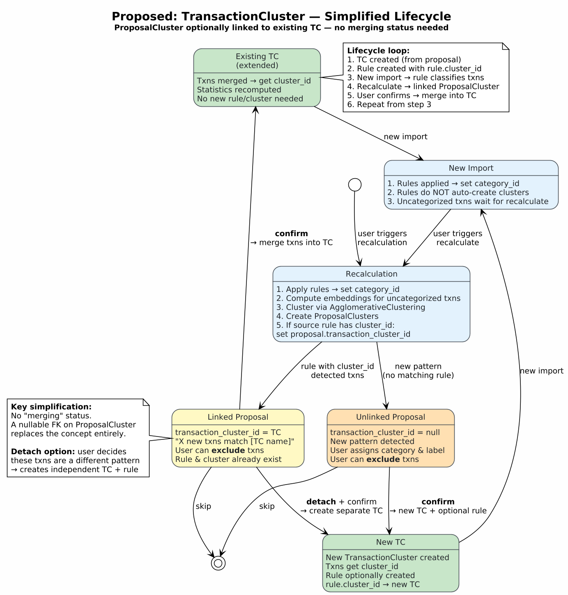

# EVOL-001 — Simplify Cluster Growth via ProposalCluster ↔ TransactionCluster Link

| Field | Value |
|-------|-------|
| **ID** | EVOL-001 |
| **Title** | Simplify cluster growth — replace merging with ProposalCluster ↔ TC link |
| **Status** | **Implemented** |
| **Implemented** | 2026-02-26 |
| **Created** | 2026-02-26 |
| **Target version** | v0.2 |
| **Priority** | High |
| **Impacts** | Backend (models, services, migration), Frontend (proposal review UX) |

---

## 1. Context

Currently, when rules match new transactions after an import, `apply_rules()` in `rule_service.py` immediately creates or merges into a `TransactionCluster` — without user review. This bypasses the proposal workflow that exists for embedding-based clustering.

A previous design proposed a `merging` status on TransactionCluster to handle this, but that added unnecessary complexity.

## 2. Proposed Solution

**Key insight**: the `merging` status is not needed. Instead, a `ProposalCluster` can optionally reference an existing `TransactionCluster` (via the rule that detected the transactions). On confirmation, the proposal's transactions are merged directly into the existing TC — no intermediate status required.

### 2.1 New Fields Required

| Field | On Entity | Type | Purpose |
|-------|-----------|------|---------|
| `cluster_id` | `ClassificationRule` | FK → `transaction_clusters`, nullable | Back-reference from rule to the TransactionCluster it belongs to. Enables automatic linking of proposal clusters to existing TCs. |
| `transaction_cluster_id` | `ClassificationProposalCluster` | FK → `transaction_clusters`, nullable | Optional FK to an existing TransactionCluster. Set when the proposal was generated by a rule that has `cluster_id`. Null for genuinely new patterns. |

### 2.2 Behavior Changes

| Aspect | Current (v0.1) | Proposed (v0.2) |
|--------|----------------|-----------------|
| **Rule → Cluster link** | `TransactionCluster.rule_id` (cluster points to rule) | Bidirectional: also `ClassificationRule.cluster_id` (rule points to cluster) |
| **Rule auto-creates clusters** | `apply_rules()` immediately creates/merges TCs | Rules only classify (set `category_id`). No auto-creation. Cluster assignment happens via proposal review only. |
| **ProposalCluster linked to TC** | No link | `ProposalCluster.transaction_cluster_id` set when source rule has `cluster_id` |
| **`merging` status** | Was proposed | **Not needed** — replaced by the simpler ProposalCluster ↔ TC link |
| **UX on accept (linked)** | N/A | Merge txns into existing TC (no rule/cluster creation needed). Option to "detach" and create new TC instead. |
| **UX on accept (unlinked)** | Creates new TC | Same: create new TC + optionally create rule with `rule.cluster_id` set |

## 3. Target Lifecycle



### Three UX Scenarios

**Scenario A — Linked proposal (rule with `cluster_id` detected txns):**
1. Recalculate applies rules → txns get `category_id`
2. ProposalCluster created with `transaction_cluster_id` = rule's TC
3. User sees: "X new transactions match cluster *[TC name]*"
4. User can **exclude** specific txns, then **confirm** → txns get `cluster_id` of existing TC
5. No new rule or cluster is created — they already exist

**Scenario B — Linked proposal, user detaches:**
1. Same as A, but user decides these txns are a different pattern
2. User clicks **"Create new cluster"** → cuts the link with existing TC
3. Behaves like Scenario C from here: new TC + optionally new rule

**Scenario C — Unlinked proposal (new pattern):**
1. Recalculate detects a new pattern via embedding clustering
2. ProposalCluster has `transaction_cluster_id = null`
3. User reviews: assign category, define label
4. User **confirms** → creates new `TransactionCluster`
5. Optionally creates `ClassificationRule` with `rule.cluster_id` pointing to the new TC
6. Future imports: rule classifies + links proposals back to this TC (Scenario A)

### Why this is better than `merging`

The `merging` status added complexity without value. The real need is simply: "does this proposal extend an existing cluster or is it new?" A nullable FK on ProposalCluster expresses this cleanly. The UX becomes simpler: confirm = merge, detach = create new.

## 4. Implementation Plan

### 4.1 Database Migration

- Add `cluster_id` column (nullable FK) to `classification_rules` table
- Add `transaction_cluster_id` column (nullable FK) to `classification_proposal_clusters` table
- Both with `ondelete='SET NULL'`

### 4.2 Model Changes

- `ClassificationRule`: add `cluster_id` field + relationship to `TransactionCluster`
- `ClassificationProposalCluster`: add `transaction_cluster_id` field + relationship

### 4.3 Service Changes

- **`rule_service.py`**: Remove auto-creation/merging of TransactionClusters from `apply_rules()`. Rules only set `category_id` on matched transactions.
- **`classification_service.py`**:
  - During `recalculate()`: after applying rules, check which rules have `cluster_id`. For matched txns from those rules, create linked ProposalClusters with `transaction_cluster_id` set.
  - On `apply_cluster()`: if `transaction_cluster_id` is set → merge txns into existing TC. If null → create new TC as today.
- **`cluster_service.py`**: Add logic to handle the "detach" action (nullify `transaction_cluster_id`, then treat as new).

### 4.4 API Changes

- `POST /classification/apply-cluster`: handle linked vs unlinked logic
- Add optional `detach` parameter for linked proposals
- Response should indicate whether txns were merged into existing TC or new TC created

### 4.5 Frontend Changes (future)

- Proposal review UI: differentiate linked (show TC name, merge action) vs unlinked (show create action)
- Add "detach" button for linked proposals
- Show existing TC statistics when reviewing a linked proposal

## 5. Lifecycle Loop (steady state)

```
1. TC created (from proposal) → rule created with rule.cluster_id
2. New import → rule classifies txns (sets category_id only)
3. Recalculate → linked ProposalCluster (transaction_cluster_id = TC)
4. User confirms → merge txns into TC → statistics recomputed
5. Repeat from step 2
```

## 6. Acceptance Criteria

- [ ] `ClassificationRule` has `cluster_id` FK to `transaction_clusters`
- [ ] `ClassificationProposalCluster` has `transaction_cluster_id` FK
- [ ] `apply_rules()` no longer creates/merges TransactionClusters
- [ ] `recalculate()` creates linked ProposalClusters when rule has `cluster_id`
- [ ] `apply_cluster()` merges into existing TC when `transaction_cluster_id` is set
- [ ] "Detach" action creates new TC instead of merging
- [ ] Alembic migration for both new columns
- [ ] Existing tests pass
- [ ] PIM documentation updated
